# La mejor teinda del borojo: Tienda Chen 🥝


Los mejores borojos los encontrarás en la tienda Chen, la tienda líder en productos de borojo. Descubre los beneficios de esta maravillosa fruta que rejuvenece tu cuerpo, mejora cómo te sientes, y cuida tu piel, cabello y salud en general.

Para optimizar su operación, esta tienda requiere una base de datos eficiente que gestione todos sus productos, ventas, clientes, proveedores e inventario. La base de datos debe ser capaz de responder a todas las consultas y facilitar una gestión integral y ágil.

## Colecciones creadas

### Clientes 👨

Esta colección contiene la información personal y de contacto de todos los clientes de la tienda. Incluye datos como nombre, dirección, teléfono, correo electrónico y historial de compras para ofrecer un mejor servicio y seguimiento personalizado.

### Productos 🍎

En esta colección se almacenan los detalles de todos los productos disponibles en la tienda, como nombre, descripción, categoría, precio, y propiedades específicas (por ejemplo, beneficios del borojo). También puede incluir imágenes y datos sobre su origen o presentación.

### Proveedores 🏙️

Aquí se registra toda la información relevante de los proveedores que suministran productos a la tienda. Datos como nombre de la empresa, contacto, dirección, términos de entrega y precios, para facilitar la gestión y comunicación con cada proveedor.

### Ventas 💸

Esta colección guarda un historial completo de las transacciones realizadas en la tienda. Registra datos como fecha de compra, productos vendidos, cantidades, precios, clientes involucrados y métodos de pago, permitiendo análisis de ventas y control financiero.

### Inventario 🗄️

La colección de inventario monitorea la cantidad disponible de cada producto en la tienda. Incluye registros de entradas, salidas, niveles mínimos y máximos, ayudando a mantener un control eficiente y evitar faltantes o exceso de stock.

## Insercion de datos nuevos ➕

1. Insertar un nuevo producto llamado "Chocolatina de borojó", categoría "Snack", con precio 4000, stock 35, y tags ["dulce", "energía"].

```jsx
db.productos.insertOne(
	{
      _id: 11,
      nombre: "Chocolatina de Borojó",
      categoria: "Snack",
      precio: 4000,
      stock: 35,
      tags: ["dulce", "energía"]
    }
)
```
<br>

2. Insertar un nuevo cliente que se llama "Mario Mendoza", con correo "mario@email.com", sin compras, y preferencias "energético" y "natural".

```jsx
 db.clientes.insertOne(
      {
          _id: 11,
          nombre: "Mario Mendoza",
          email: "mario@email.com",
          compras: [],
          preferencias: ["energético", "natural"]
      }
)
```
<br>

## Lecturas 📖

1. Consultar todos los productos que tengan stock mayor a 20 unidades.

```jsx
db.productos.find(
    {
        stock: { $gt: 20 }
    }
).toArray()
```
<br>

2. Encontrar los clientes que no han comprado aún ningún producto.

```jsx
db.clientes.find(
    {
        compras:{$eq:[]}
    }
).toArray()
```

## Actualizaciones 🔵

1. Aumentar en 10 unidades el stock del producto "Borojó deshidratado".

```jsx
db.productos.updateOne(
    {nombre:"Borojó deshidratado"},
    {$inc:{stock:10}}
)
```
<br>

2. Añadir el tag "bajo azúcar" a todos los productos de la categoría "Bebida".

```jsx
db.productos.updateMany(
    {categoria:"Bebida"},
    {$push:{tags:"bajo azúcar"}}
)
```

## Eliminaciones 🔴

1. Eliminar el cliente que tenga el correo "juan@email.com".

```jsx
db.clientes.deleteOne(
    {email:"juan@email.com"}
)
```

2. Eliminar todos los productos con stock menor a 5 (considera esto como un proceso de limpieza de inventario).
```jsx
printjson(
    db.productos.deleteMany(
        {stock:{$lt:5}}
    )
)
```

## Expresiones Regulares 🔧

En esta sección se encuentran las consultas que utilizan expresiones regulares mediante el operador $regex.

**1. Buscar productos cuyo nombre empiece por "Boro".**

```jsx
db.productos.find(
    {nombre:{$regex:"^Boro"}}
)

```
<br>

**2. Encontrar productos cuyo nombre contenga la palabra "con" (como en “Concentrado de borojó”).**
```jsx
db.productos.find(
	{nombre:{$regex:"con",$option:"i"}}
)
```
<br>

**3. Encontrar clientes cuyo nombre tenga la letra "z" (insensible a mayúsculas/minúsculas).**

```jsx
db.clientes.find(
    {nombre:{$regex:"[Zz]"}}
)
```

## Operadores en consultas sobre arrays 📲

una serie de operadores especializados para trabajar con campos de tipo array, lo que permite realizar búsquedas avanzadas y precisas dentro de documentos que contienen listas de valores u objetos.

**1. Buscar clientes que tengan "natural" en sus preferencias.**

```jsx
db.clientes.find(
    {preferencias:{$in: ["natural"]}}
)
```
<br>

**2. Encontrar productos que tengan al menos los tags "natural" y "orgánico" (usa $all).**
```jsx
db.productos.find(
    {tags:{$all: ["natural","orgánico"]}}
)
```
<br>

**3. Listar productos que tienen más de un tag ($size).**
```jsx
db.productos.find(
    { $expr: { $gt: [ { $size: "$tags" }, 1 ] } }
)
```

## Aggregation Framework con Pipelines 🧮

**1. Mostrar un listado de los productos más vendidos (suma total de unidades vendidas por producto).**

```jsx
db.ventas.aggregate([
  { $unwind: "$productos" },
  { 
    $group: { 
      _id: "$productos.productoId", 
      cantidad: { $sum: "$productos.cantidad" } 
    } 
  },
  { $sort: { cantidad: -1 } },
  { $limit: 3 }
])
```

En esta consulta se aplica $unwind para descomponer el array productos en múltiples documentos individuales, lo que permite trabajar cada producto por separado dentro del pipeline. A continuación, se utiliza $group para sumar la cantidad vendida de cada producto y obtener su total acumulado. Después, los resultados se organizan en orden descendente mediante $sort, y finalmente se emplea $limit para restringir la salida a los tres productos más vendidos.

**Resultado**

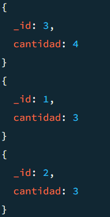

<br>

**2. Agrupar clientes por cantidad de compras realizadas.**

```jsx
db.clientes.aggregate([
    {$unwind: "$compras"},
    { $group: {_id: "$_id", totalCompras: { $sum: 1 } } },
    { $sort: { totalCompras: -1 } }
])
```

**Explicación**

En esta consulta se emplea `$unwind` para descomponer el array compras, lo que permite acceder a cada elemento de forma individual y procesarlo correctamente dentro del pipeline. Posteriormente, se utiliza $group para agrupar los documentos por su _id y calcular la suma correspondiente. Finalmente, se aplica $sort para ordenar los resultados en orden descendente según el valor agregado.

**Resultado**

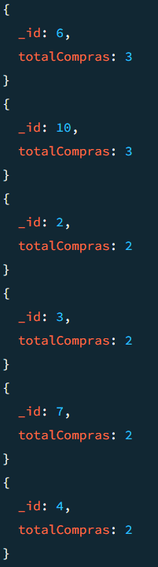

<br>

**3. Mostrar el total de ventas por mes**

```jsx
db.ventas.aggregate([
    {$group: {_id: { mes: { $month: "$fecha"}}, totalVentas: {$sum: 1}}}
])
```

**Explicación**

En esta consulta los documentos se agrupan por mes utilizando `$month`, lo que permite clasificar las ventas según la fecha registrada. Luego, mediante $sum, se calcula el total de compras realizadas en cada mes.

**Resultado**

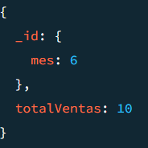

**4. Calcular el promedio de precios por categoría de producto.**

```jsx
db.productos.aggregate([
    {$group: {_id: "$categoria", precioPromedio: {$avg: "$precio"}}}
])
```

**Explicación**
En esta consulta los productos se agrupan según su categoría, y mediante el operador `$avg` se calcula el promedio de precios correspondiente a cada una de ellas.

**Resultado**

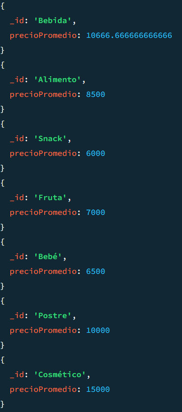

**5. Mostrar los 3 productos con mayor stock**

```jsx
db.productos.aggregate([
    {$sort: {stock: -1}},
    {$limit: 3},
    {$project: {nombre: 1, stock: 1}}
])
```

**Explicación**
Los productos se ordenan en orden descendente, se limitan a los 3 primeros resultados y se realiza una proyección para mostrar únicamente el nombre y el stock de cada producto.

**Resultado**

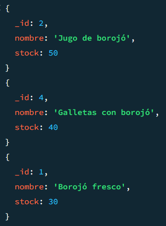

## Funciones definidas en system.js 🛞

**1. Definir una función calcularDescuento(precio, porcentaje) que devuelva el precio con descuento aplicado.**

```jsx
db.system.js.insertOne({
    _id: "calcularDescuento",
    value: new Code("function(precio, porcentaje) {return precio - (precio * (porcentaje / 100)); }")
});

const f1 = db.system.js.findOne({ _id: "calcularDescuento" });
const calcularDescuento = new Function('return ' + f1.value.code)();

const helado = db.productos.findOne({ _id: 6 });
calcularDescuento(helado.precio,20)
```

**Explicación**

- Se inserta la función en system.js con un identificador único.

- Se obtiene su definición almacenada.

- Se reconstruye como función en JavaScript.

- Se ejecuta sobre los datos de la colección, en este caso calculando el nuevo precio con descuento.

<br>

**2. Definir una función clienteActivo(idCliente) que devuelva true si el cliente tiene más de 3 compras registradas.**

```jsx
db.system.js.insertOne({
  _id: "clienteActivo",
  value: new Code("function(idCliente) {var cliente = db.clientes.findOne({ _id: idCliente });if (!cliente) return false;return cliente.compras.length > 3;}")
});

const f2 = db.system.js.findOne({ _id: "clienteActivo" });
const clienteActivo = new Function('return ' + f2.value.code)();

clienteActivo(10);
```

**Explicación**

- Busca un cliente en la colección clientes a partir de su _id.

- Si el cliente no existe, devuelve false.

- Si existe, verifica el tamaño del array compras.

- Retorna true únicamente cuando el cliente tiene más de 3 compras.

<br>

**3. Definir una función verificarStock(productoId, cantidadDeseada) que retorne si hay suficiente stock.**

```jsx
db.system.js.insertOne({
  _id: "verificarStock",
  value: new Code("function(productoId, cantidadDeseada) {var producto = db.productos.findOne({ _id: productoId });if (!producto) return false;return producto.stock >= cantidadDeseada;}")
});

const f3 = db.system.js.findOne({ _id: "verificarStock" });
const verificarStock = new Function('return ' + f3.value.code)();

const aceite = db.productos.findOne({ _id: 9 });
verificarStock(aceite._id, 5)
```

**Explicación**

- Busca en la colección productos el documento con el _id indicado.

- Si el producto no existe, devuelve false.

- Si existe, compara el campo stock con la cantidad deseada.

- Retorna true si el stock es suficiente, o false en caso contrario.

## Transacciones 🖲️

Transacciones que realiza la tienda del borojo, transacciones muy comunes y que son cruciales para la gestion de sus ventas, inventario o productos.

**1. Simular una venta:**

a. Descontar del stock del producto

b. Insertar la venta en la colección `ventas`(Todo dentro de una transacción.)

```jsx
const session = db.getMongo().startSession();
const dbSession = session.getDatabase("tienda_borojo");
session.startTransaction();

try {
    dbSession.productos.updateOne(
        {_id: 8},
        {$inc:{stock:-5}}
    );

    dbSession.ventas.insertOne(
        {
            _id: 11,
            clienteId: 5,
            productos: [{
                productoId: 8,
                cantidad: 5
            }],
            fecha: new Date(),
            total: 45000
        }
    );

    session.commitTransaction();
    print("☑️ Transaccion finalizada con exito!")
} catch (error) {
    session.abortTransaction();
    print("❌ Transaccion cancelada!")
} finally {
    session.endSession();
}
```

**Explicación**

- Se inicia una sesión y se obtiene la base de datos dentro de la transacción.

- Se reduce el stock del producto con _id: 8 en 5 unidades.

- Se inserta una nueva venta con la información del cliente, productos, fecha y total.

- Si todo funciona bien → commitTransaction() guarda los cambios en la base de datos.

- Si ocurre un error → abortTransaction() revierte ambas operaciones, manteniendo la integridad.

- Finalmente, se cierra la sesión.

<br>

**2. Simular la entrada de nuevo inventario:**

a. Insertar un documento en inventario

b. Aumentar el stock del producto correspondiente (Todo dentro de una transacción.)

```jsx
const session = db.getMongo().startSession();
const dbSession = session.getDatabase("tienda_borojo");
session.startTransaction();

try {
    dbSession.inventario.insertOne(
        {
            _id: 11,
            productoId: 9,
            lote: "L011",
            cantidad: 12,
            fecha: new Date()
        }
    );

    dbSession.productos.updateOne(
        { _id: 9 },
        { $inc: { stock: 12 } }
    );

    session.commitTransaction();
    print("☑️ Transaccion finalizada con exito!")
} catch (error) {
    session.abortTransaction();
    print("❌ Transaccion cancelada!")
} finally {
    session.endSession();
}
```

**Explicación**

- Se inicia una sesión y una transacción en la base de datos tienda_borojo.

- Se inserta un nuevo lote en la colección inventario con su cantidad, lote y fecha de ingreso.

- Se incrementa el stock del producto en la colección productos en la misma cantidad ingresada.

- Si todo se ejecuta correctamente → commitTransaction() confirma los cambios en ambas colecciones.

- Si ocurre un error → abortTransaction() cancela todas las operaciones, evitando inconsistencias.

- Finalmente, se cierra la sesión.

<br>


**3. Hacer una operación de devolución:**

a. Aumentar el stock

b. Eliminar la venta correspondiente

```jsx
const session = db.getMongo().startSession();
const dbSession = session.getDatabase("tienda_borojo");
session.startTransaction();

try {
    dbSession.productos.updateOne(
        { _id: 2 },
        { $inc: { stock: 1 } },
    );

    dbSession.productos.updateOne(
        { _id: 3 },
        { $inc: { stock: 1 } }
    )

    dbSession.ventas.deleteOne(
        { _id: 6 },
    );

    session.commitTransaction();
    print("☑️ Transaccion finalizada con exito!")
} catch (error) {
    session.abortTransaction();
    print("❌ Transaccion cancelada!")
} finally {
    session.endSession();
}
```

- Se inicia una sesión y se abre una transacción sobre la base de datos tienda_borojo.

- Se incrementa el stock de los productos con _id: 2 y _id: 3, devolviendo al inventario la cantidad que se había vendido.

- Se elimina el registro de la venta con _id: 6 en la colección ventas.

- Si todo se ejecuta correctamente → commitTransaction() confirma los cambios en ambas colecciones.

- Si ocurre un error → abortTransaction() revierte todas las operaciones, asegurando que el stock y las ventas sigan sincronizados.

- Finalmente, se cierra la sesión.

## Indices Creados

**1. Creación del indice en el campo nombre de productos**

```jsx
db.productos.createIndex({ nombre: 1 })
```

**Explicación**

"Se crea un índice en el campo nombre mediante `createIndex`, con el fin de optimizar la eficiencia y velocidad de las consultas que lo utilizan."

**Resultado**

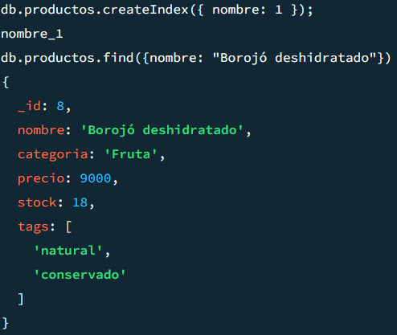

**2. Creación del indice compuesto en los campos categoria y precio de productos**

```jsx
db.productos.createIndex({ categoria: 1, precio: 1 });
```

**Explicación**

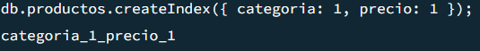

Se genera un índice compuesto sobre los campos categoria y precio, con el propósito de optimizar el rendimiento de las consultas que se apoyan en dichos campos.

**Resultado**

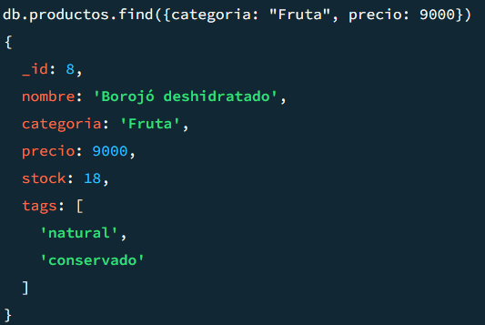

**3. Creación del indice en el campo email de usuarios**

```jsx
db.clientes.createIndex({ email: 1 });
```

**Explicación**

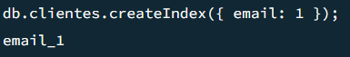

Se crea un índice en el campo email para garantizar la diferenciación entre correos electrónicos y optimizar la eficiencia en las búsquedas.

**Resultado**

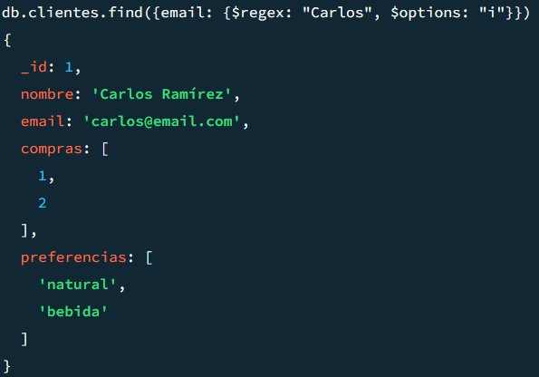

**4. Uso de explain para analizar el uso del índice en una consulta**

```jsx
db.clientes.find({email: {$regex: "Carlos", $options: "i"}}).explain()
```

**Explicación**

"Esta consulta es similar a la anterior, pero ahora se incorpora la cláusula `.explain()`, la cual proporciona información sobre la ejecución de la consulta, permitiendo determinar si la búsqueda se realizó mediante el uso de un índice o directamente sobre la colección."

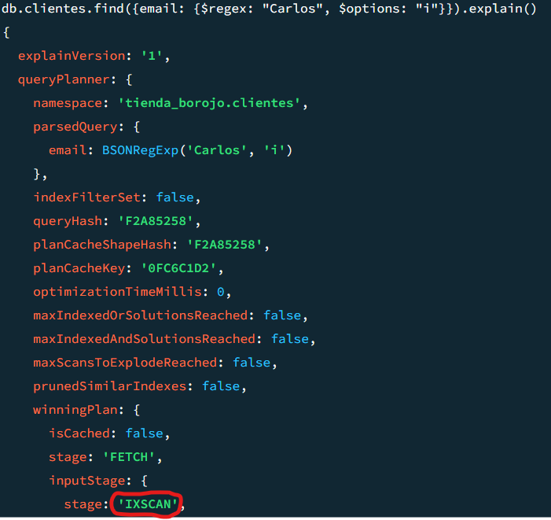

En el último campo señalado se observa que la búsqueda se ejecutó utilizando el índice en lugar de la colección completa, lo que confirma que el índice fue aplicado correctamente.

